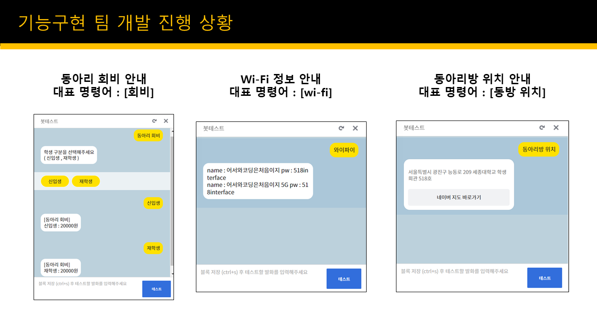

***
# __Interface-ChatBot__
***
## __2022 프로그래밍전시회 인터페이스 챗봇__

> 인터페이스 동아리를 안내하는 카카오톡 챗봇

## Member
* __주시환__
    - 팀장
    - 기능 구현
* __박상욱__
    - 멘토
    - 기능 구현
* __박서진__
    - 기능 구현
* __박세현__
    - 서버연동
* __이형민__
    - 서버연동
* __김건민__
    - 서기
    - DB
* __한건희__
    - 머신러닝

## 인터페이스 챗봇 링크
[세종대학교 인터페이스 챗봇](http://pf.kakao.com/_reezxj)<p>


## Using
 


## 기능 예시


## 구현할 기능
1. __인터페이스 활동 일정 안내__ (구현완료)
    - 기능구현 : 박서진
2. __인터페이스 인원 수 안내 (기수별, 현재 활동 중)__ (구현완료)
    - 기능구현 : 박서진
3. __인터페이스 집부 구성원 안내 (번호는 검토 필요, 메일은 가능)__ (구현완료)
    - 기능구현 : 주시환
4. __인터페이스 회비 안내__ (구현완료)
    - 기능구현 : 박상욱
5. __인터페이스 동아리 방 위치 안내__ (구현완료)
    - 기능구현 : 박상욱
6. __인터페이스 링크 안내 (깃허브, 인스타그램, 홈페이지, 앱)__ (구현완료)
    - 기능구현 : 주시환
7. __인터페이스 소개글 (역사 등등)__ (구현완료)
    - 기능구현 : 박서진
8. __인터페이스 행사 상세하게 소개 (사진 첨부)__ (구현완료)
    - 기능구현 : 주시환
9. __인터페이스 동아리방 실시간 재실 인원 체크__ (구현완료)
    - 기능구현 : 박상욱
10. __인터페이스 챗봇 도움말 (챗봇 소개글, 챗봇 기능 소개)__
    - 기능구현 : 주시환 
11. __인터페이스 동아리 방 비밀번호 안내 (학번 및 이름 체크, 악용 가능성으로 검토 필요)__ (구현 X)
    - 기능구현 : 박상욱
12. __인터페이스 동아리에 건의사항 받는 서비스 (비품, 음식 등 필요한 물품)__ (구현완료)
    - 기능구현 : 박서진
13. __인터페이스 동아리 방 와이파이 비밀번호 안내__ (구현완료)
    - 기능구현 : 박상욱

## 프로젝트 설치 방법

명령프롬프트에서 아래의 코드 실행
```
curl https://bootstrap.pypa.io/get-pip.py -o get-pip.py
python get-pip.py
pip install flask
pip install flask-cors
python app.py
```
* [python 명령어가 작동하지 않는 경우 환경 변수 설정](https://wxmin.tistory.com/121)

## 참고자료
* [구름 IDE 이용하여 카카오톡 스킬 서버 만들기](https://novice-engineers.tistory.com/m/23)
* [카카오톡 바로가기 버튼 이용](https://luckygg.tistory.com/326)
* [카카오톡 챗봇 공식 도움말](https://i.kakao.com/docs/tutorial-chatbot-key-features#%EC%9B%B0%EC%BB%B4-%EB%B8%94%EB%A1%9Dwelcome-block-%EC%84%A4%EC%A0%95%ED%95%98%EA%B8%B0)
* [Mac 터미널 이용하여 SSH 접속 방법](https://earth-95.tistory.com/54)

